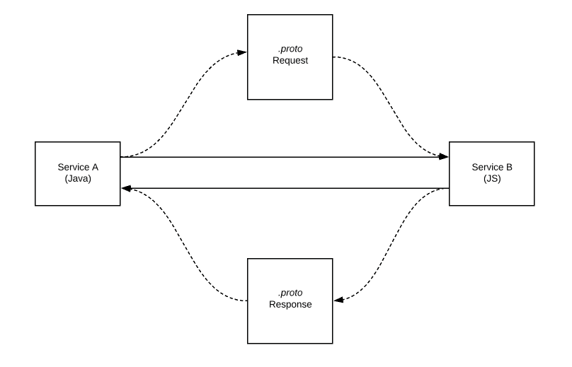
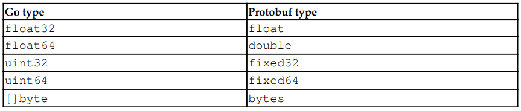

We will cover:

- Protocol Buffers
- Protocol Buffer Language
- Compiling a protocol buffer with `protoc`
- GRPC
- Bidirectional streaming w/ gRPC

---

## Protocol Buffers

Protocol buffers is a data exchange format similar to JSON. Protobuf vs JSON Both are for serialization, however, the key difference is that Protobuf is binary data –interchange format whereas JSON stores data in human-readable text format.

Protocol Buffers are strongly typed. As per definition by Google: _You can update your datastructure without breaking deployed programs that are compiled against the old datastructure format_. Interesting right? It is, we will see how that works.

Protocol Buffers allow us to define the data contract between multiple systems. Once a proto-buff file has beenn defined, we can compile it to a `target programming language`. The output of the compilation will be `classes` and `functions` of the target programming language. In Go, protocol buffers can be transported over different transports, such as HTTP/2
and Advanced Message Queuing Protocol (AMQP).



---

## Protocol Buffer Language

A protocol buffer is a file, which when compiled, will generate a file accessible to the targetted programming language. In go, it will be a `.go` file which will be a `structs mapping`.

Let us write a simple message in protobuf:

```proto
syntax 'proto3'

message UserInterace {
  int      index         = 1;
  string   firstName     = 2;
  string   lastName      = 3;
}
```

Here we just define a message type called `UserInterface`. It we were to write the same using JSON:

```json
{
  "index": 0,
  "firstName": "John",
  "lastName": "Doe"
}
```

The field names are changed to comply with the JSON style guide, but the essence and structure are the same.

**But, what are the sequential numbers(1,2,3) in the protobuf file?**

Those are the ordering tags used to `serialize` and `deserialize` proto-bufs between two systems. It tells the system to write the data in that particular order with the specified types. So when this proto-buf is compiled for targetted language `Go`, it will be a struct with the **empty default values**.

Different types that are used in protobuf:

- Scalar
- Enumerations
- Nested

### Scalar Values

Exmaples of scalar type values: int, int32, int64, string, bool etc. These types are converted to the corresponding language types after the compilation.

Since we are using Go in our case, the equivalent types in `Go` for these scalar types are:



### Enumerations (enums)

Lets take an example of a `proto` file using enums:

```proto
syntax 'proto3'
message Schedule {
  enum Days {
    SUNDAY = 0;
    MONDAY = 1;
    FRIDAY = 2;
  }
}
```

And in case we want to assign the same values to multiple enum members:

```proto
syntax 'proto3'
message Schedule {
  enum Days {
    option allow_aias = true; 👈
    UNKNOWN  = 0;
    ACTIVE   = 1;
    INACTIVE = 1;
  }
}
```

**repeated** field is equavalent to array/list:

```proto
message CarInfo {
  string type = 1;
  repeated string cars = 2;
}
```

This means, the `cars` could be `[]string` like `["bmw", "toyota", "honda"]`.

### Nested Fields

We can also use message as a type for another message.

Example:

```proto
message User{
  string firstName  = 1;
  string lastName  = 2;
  repeated Comment comments= 3;
}

message Comment{
  int id = 1;
}
```

---

## Compiling Protocol Buffer with protoc

To transfer data between the systems, we will make use of the compiled files from the `proto` proto files. We will make use of the structs (gotten from the compiled files) to create the binary data.

Steps we will follow:

1. Install the `protoc` comman-line tool and the `proto` library
2. Write `.proto` file
3. Compile the file for `Go` target language
4. Import the structs from the generated file and create data using those
5. Serialize the data into binary format and send it to the other system
6. On the remote machine, de-serialize the data and consume it

We will install he protoc command line from `https://github.com/protocolbuffers/protobuf/releases`

I am on windows, so I will install download the latest stable package and set the environment variable from `Edit the system environment variable setting` in the **control panel**.

Download and unzip (for Windows) : https://github.com/protocolbuffers/protobuf/releases/download/v3.17.3/protoc-3.17.3-win64.zip

- I will extract it in the `C:\Program Files\protoc` folder (by creating the protoc folder). It must now have `bin` folder.
- Now search for `Edit the system environment variable setting` on start menu, double click on `Path` in the list.
- Now click on `New` and then `Browse...`
- Browse until `C:\Program Files\protoc\bin` and click `ok`.
- Now open a fresh terminal and type `protoc --version` to confirm the installation. The output must be:

```bash
$ protoc --version
libprotoc 3.17.3
```

### **For MAC and Linux**

**On mac**

$ brew install protobuf

**On Ubuntu or Linux, we can copy protoc to the /usr/bin folder:**

Make sure you grab the latest version

`curl -OL https://github.com/protocolbuffers/protobuf/releases/download/v3.17.3/protobuf-all-3.17.3.zip`

Unzip

`unzip protoc-3.11.3-linux-x86_64.zip -d protoc3`

Move only protoc\* to /usr/bin/

`sudo mv protoc3/bin/protoc /usr/bin/protoc`

After installing and setting up the command line tool, make sure you are able to access it from your terminal:

```bash
$ protoc --version
libprotoc 3.17.3
```

Now in our project directory, create a new folder `protofiles` and then in it let us create a proto file representing/modeling a person's information:

`person.proto`

```proto
syntax = "proto3"
package protofiles;
option go_package = "./";

message Person {
  string     name     =    1;
  int32      id       =    2;
  string     email    =    3;
  repeated   PhoneNumber  phones = 4;

  enum PhoneType {
    MOBILE  =  0;
    HOME    =  1;
    WORK    =  2;
  }

  message PhoneNumber {
    string      number  = 1;
    PhoneType   type    = 2;
  }
}

message AddressBook {
  repeated   Person  people = 1;
}
```

So we just created two main messages called Person and AddressBook. The AddressBook contains the list of Persons.
A person has a name, id, email and list of PhoneNumbers.

The second line `package protofiles` is the package name for go to compile.

To compile our person.proto proto-buf file, `cd` to the protofiles directory and run:

1. `go get -u github.com/golang/protobuf/protoc-gen-go`
   _protoc-gen-go is a plugin for the Google protocol buffer compiler to generate Go code._

2. `protoc --go_out=. *.proto`
   _this will create a Go target file in the present working directory from where the command is run (the dot) and make use of all the proto files to do so_

This will generate a `person.pb.go` file. If you open this file you will see that it contains the auto generated code for us.
This will have multiple `getter` and `setter` methods for the structs to get and set the values.
